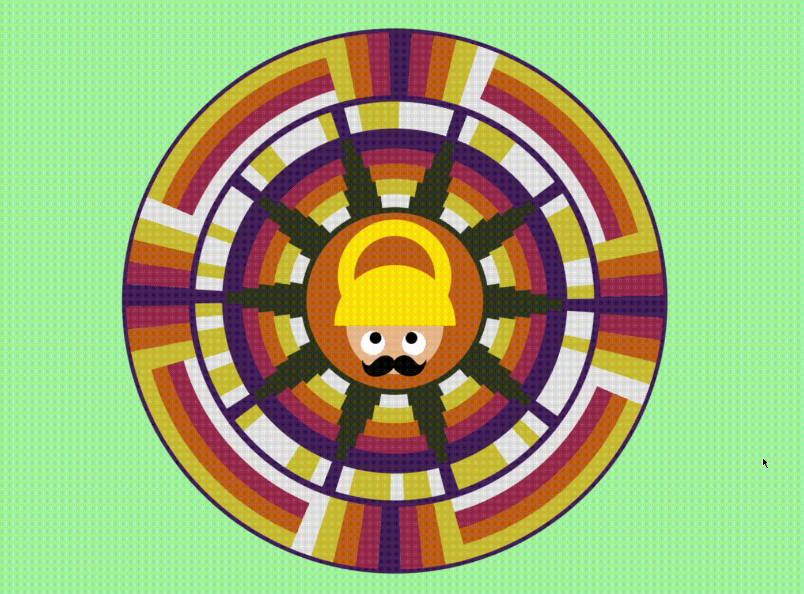
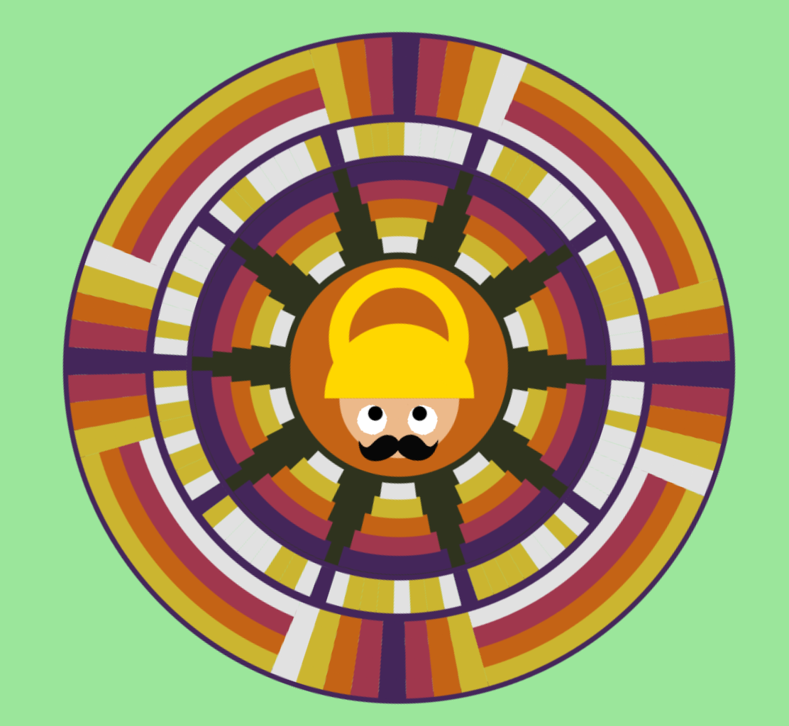

# Code A Pookalam 🌸 by [Aadil Varsh](https://instagram.com/advrxh)

# 🎥 Screenrecording

# 📷 Screenshot

# ❓About the design

## Stack Used

Javascript Canvas API and a lot of math.

File with design logics [index.js](./index.js)

## Layer Explanations (From Outer to Inner)

* Layer 1:
    > Arbitrary geometric design.

* Layer 2:
    > It says 'happy onam' in ascii encoded 10 bytes. Starting with the first frame at 9 o clock. White being a **0**, Yellow being a **1**.

* Layer 3:
    > Arbitrary geometric design.

* Layer 4:
    > Interactive Mahabali design which follows his Kuda.
